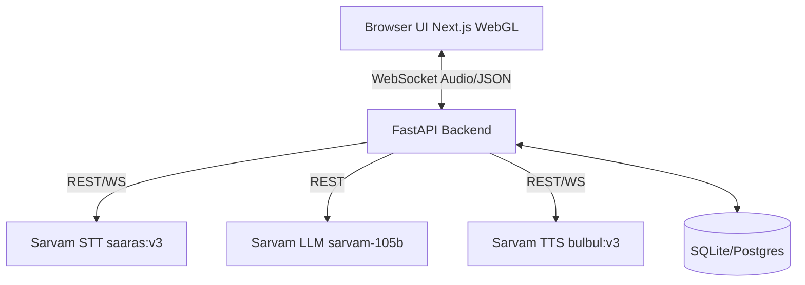

# Vaani Architecture

## 1. System Diagram



## 2. Data Flow (One Conversational Turn)
1. **User Speaks:** Browser captures WebM audio via `MediaRecorder` and streams chunks to the FastAPI backend over WebSocket.
2. **STT Processing:** Backend writes chunks to a temporary `.webm` file and sends it to Sarvam STT using the REST API (`client.speech_to_text.transcribe`).
3. **Inference:** Backend appends the user text to the `conversation` memory log (a list of `{"role": "...", "content": "..."}` dicts), constructs the prompt, and calls Sarvam LLM (`sarvam-105b` via `client.chat.completions`).
4. **TTS Generation:** Backend receives LLM text, requests Sarvam TTS (`bulbul:v3`, `te-IN`, `kavitha`, pace `1.0`).
5. **Playback:** Backend sends base64 WAV payload over WebSocket to the Browser.
6. **UI Reacts:** The WebGL voice orb visually reacts to the audio frequency data during playback.

## 3. WebSocket Message Protocol Draft
**Browser -> Backend:**
```json
{
  "type": "audio_stream",
  "data": "base64_encoded_webm_chunk"
}
```
**Backend -> Browser:**
```json
{
  "type": "agent_response",
  "state": "speaking",
  "transcript": "రేపు ఉదయం 10 గంటలకు స్లాట్ ఖాళీగా ఉంది.",
  "audio_wav": "base64_encoded_wav_data"
}
```

## 4. Data Model Draft (SQLModel)
```python
class Conversation(SQLModel, table=True):
    id: int | None = Field(default=None, primary_key=True)
    session_id: str
    user_transcript: str
    agent_response: str
    created_at: datetime
```

## 5. Architectural Decision Records (ADRs)

### ADR-001: Monorepo Structure
- **Decision:** Use pnpm workspaces for a monorepo setup (`apps/web`, `apps/api`, `packages/shared`).
- **Rationale:** Ensures synchronized deployments, shared TypeScript types between the FastAPI backend and Next.js frontend, and a unified DX. It is superior to separate repos which suffer from type drift and complex local orchestration.

### ADR-002: Motion and Visuals Stack
- **Decision:** Use framer-motion, GSAP + ScrollTrigger, Lenis for smooth scroll, and raw WebGL/OGL for the voice orb.
- **Rationale:** Standard CSS transitions are insufficient for the "Premium Dark AI" physics-based feel. WebGL is mandatory for real-time audio frequency visualization.

### ADR-003: Database
- **Decision:** SQLite in development, with Postgres-compatible schemas (using SQLModel and Alembic).
- **Rationale:** SQLite allows zero-config local dev. SQLModel ensures smooth transition to Postgres in production without massive ORM rewrites.

### ADR-004: Testing Strategy
- **Decision:** pytest for backend, Vitest for frontend units, Playwright for E2E.
- **Rationale:** Standard, modern toolchain. Playwright is preferred over Cypress for its superior iframe and multi-tab support, which is critical for simulating multi-user appointment booking collisions.
